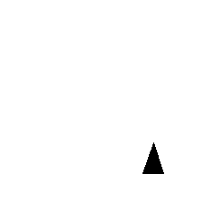
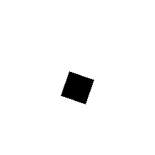
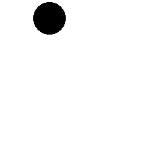
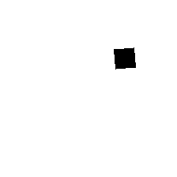

# visual-attention-analysis

`python main.py --output my_images --size 224 --num 10000 --rotate`






```csv
Image,Shape
my_images/image_1.png,triangle
my_images/image_2.png,square
my_images/image_3.png,circle
my_images/image_4.png,square
```